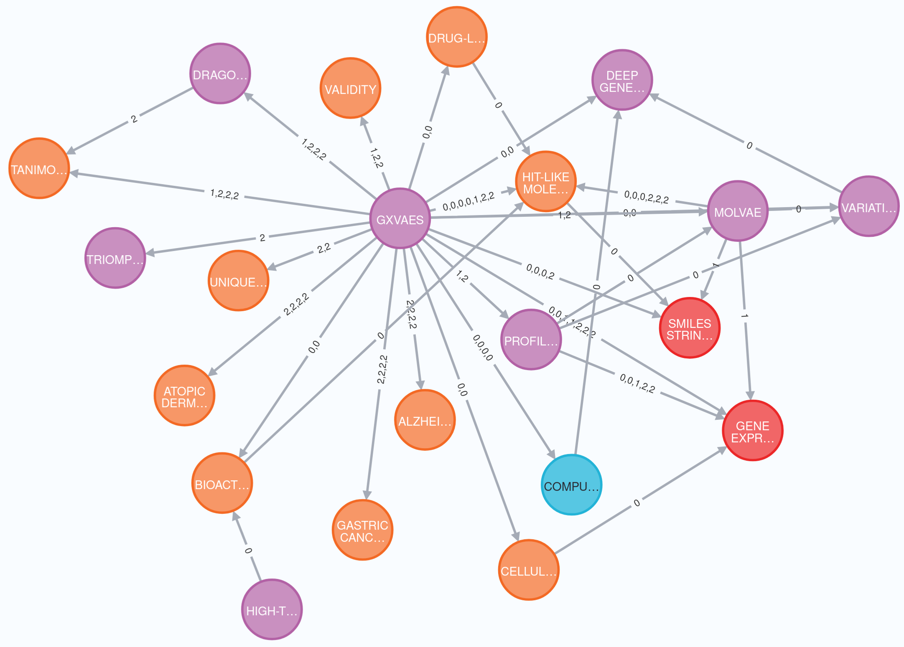
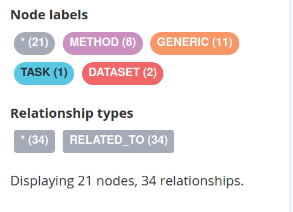
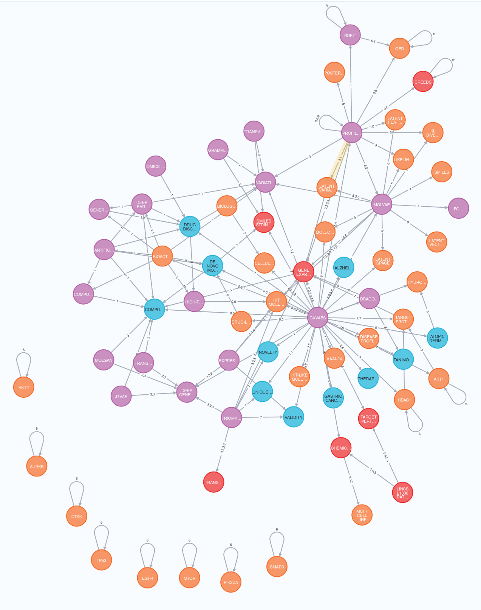
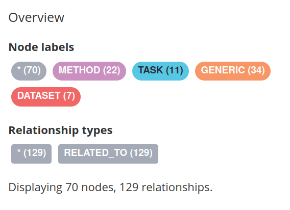

# BODHI: Configurable scientific Knowledge Graph extraction system 
Bodhi is a Large Language Model (LLM)-powered, **highly configurable**, scientific knowledge graph extraction system. It features **multiple validation and feedback loops** to ensure reliability and precision.

# How to use?
Bodhi uses YAML files for configuration. Configuration files are compatible with OmegaConf. Hydra is used to orchestrate experiments of configuration ablations. 

## Minimum configuration
A config file in yaml format with following parameters
```yaml 
# config.yml
#========================
# LLM configurations
#----------------------------
fast_model: "gemini-2.5-flash-lite" 
general_model: "gemini-2.5-flash-lite" # Used most widely across the system
thinking_model: "gemini-2.5-pro" # Used for resolving impasses resulted from repeating loops in the system
inference_engine: "vertexai" # Supports Ollama and Vertexai

# Storage configurations
#----------------------------
storage_backend: "LocalStorage" # Current implementation supports File System based storage. LocalStorage uses standard python OS libraries for file management. Future versions will support object storage backends such as MinIO.
storage_dir: "tests/storage" # The root directory for all the artifacts. Bodhi will build a folder hierarchy on top of this root directory to store all artifacts generated during KG extraction

# KG Extraction configurations
#----------------------------
max_num_threads: 18 # Maximum number of parallel threads for KG extraction
token_limit: 300 # Text unit token length. Each source document is split into text units before KG extraction. This parameter sets the maximum token limit per text unit

# Ablation parameters
#--------------------
priming: True # If enabled, Bodhi will construct a priming summary from the source document and use it as a biasing context for the KG extraction
generic_type_allowance: True # If enabled, entity type "generic" will be allowed for entities which do not belong to any of the other allowed entity types. Bodhi expects a dicitonary of entity types with a brief explanation for each entity type. 

# seed variable for multi sampling 
seed: 0 # This parameter is used to set the seed variable in underlying langchain vertexai and ollama wrappers. This is also used during hydra based experiment orchestration
```
- Bodhi module expects configuration in a dictionary format. It's the users responsibility to prepare and load the configuraitons into the input dictionary. 
    - Through this design choice, we avoided dependence on any one particular config file type. 

## Expected files and storage locations 
Bodhi supports source documents in .md, .pdf and .txt formats.<br>
Source documents are expected to be present under the directory:<br>
`<storage_dir>/data`, where <storage_dir> is the directory specified in the config.yaml file
Sample artifacts directory with 600 token configuration and maximum 18 thread. System split source document("AAAI2024") into 4 chunks and assigned each chunk to a thread for KG extraction(Map step). Finally all the intermediate files are deduplicated and combined to form AAI2024_combined_intermediate_data.yml. From this file, system generates the final graph.
```bash

tests/storage
├── Bodhi
│   └── AAAI2024
│       ├── 0
│       │   └── AAAI2024_intermediate_data.yml
│       ├── 1
│       │   └── AAAI2024_intermediate_data.yml
│       ├── 2
│       │   └── AAAI2024_intermediate_data.yml
│       ├── AAAI2024_combined_intermediate_data.yml # Intermediate KG
|       ├── AAAI2024_dd_intermediate_data.yml # Deduplicated intermediate KG
│       ├── AAAI2024_graph.yml # Final extracted knowledge graph
│       ├── AAAI2024_ref_separated_text.yml # Source text with references separated
│       ├── AAAI2024_text_units.yml  # Tokenized text chunks
│       └── AAAI2024_text.yml
└── data
    └── AAAI2024.md
```

## Finally, How to run Bodhi..
*Refer [sample_use.py](tests/sample_use.py)*

1. Load the configuration dictionary
```python
config_path = "tests/sample_config.yml"
# Load config
config = load_config(config_path)
```
2. Create object of Bodhi with the configuration dictionary
```python
# Prepare Bodhi
bodhi = Bodhi(config=config)
```
3. Prepare an ontology dictionary with allowed entity types 
```python
entity_types = {"task":"Represents a scientific or application-oriented objective that the method is designed to accomplish","method":"Refers to a specific algorithm, model, computational technique, statistical tool, or approach used in the study","dataset":"Refers to a structured collection of data, often from biological, chemical, or clinical sources, used to train, validate, or test methods","generic":"Generic type. Use this if extracted entity doesn't not belong to any other types. Consider this as a type failure fallback. Try not to use this entity type as much as possible"}
# Prepare initial state
ontology = {"entity_types":entity_types}
```
**You must provide an ontology dictionary with allowed entity types.**
4. Choose the source document from which knowledge graph to be extracted. Ensure the document is placed in <storage_dir>/data. For example, `tests/storage/data/AAAI2024.md`.
```python
doc_path = "AAAI2024.md"
```
5. Prepare initial state dictionary for Bodhi
```python 
# Prepare initial state
init_state = {
    "source_path": doc_path,
    "ontology": ontology
}
```
6. Run Bodhi with initial state
```python
# Run Bodhi extraction
bodhi.invoke(init_state)
```
- Primary output: <storage_dir>/Bodhi/<doc_name>_graph.yml (final knowledge graph).
- Intermediate artifacts: Combined KG, text units, and reference-separated text.
    - All the extraction artifacts will be stored in <storage_dir>/Bodhi

## Results
Extracted KG is converted to networkX graph, then serialized using node_link_data() api from networkX. <doc_name>_graph.yml file is the serialized output of the networkX graph. We converted netX graph to cypher format supported by neo4j. Then the graph is loaded to neo4j database. Following illustrations are generated from neo4j.
### The source document: AAAI2024
This research paper discuss about GxVAE model.
```markdown
"GxVAEs : Two Joint VAEs Generate Hit Molecules from Gene Expression Profiles . The de novo generation of hit-like molecules that show bioactivity and drug-likeness is an important task in computer-aided drug discovery . Although artificial intelligence can generate molecules with desired chemical properties , most previous studies have ignored the influence of disease-related cellular environments . This study proposes a novel deep generative model called GxVAEs to generate hit-like molecules from gene expression profiles by leveraging two joint variational autoencoders( VAEs ). The first VAE , ProfileVAE , extracts latent features from gene expression profiles . The extracted features serve as the conditions that guide the second VAE , which is called MolVAE , in generating hit-like molecules . GxVAEs bridge the gap between molecular generation and the cellular environment in a biological system , and produce molecules that are biologically meaningful in the context of specific diseases . Experiments and case studies on the generation of therapeutic molecules show that GxVAEs outperforms current state-of-the-art baselines and yield hit-like molecules with potential bioactivity and drug-like properties..."
```
### Deduplicated intermediate graph: AAAI2024_dd_intermediate_data.yml
```yml
entities:
  Alzheimer's disease:
    description:
    - A disease for which GxVAEs generated candidate therapeutic molecules with structural
      features similar to known approved drugs.
    source_chunk_index:
    - 2
    type:
    - generic
  Bioactivity:
    description:
    - The ability of a molecule to produce a biological effect, a desired characteristic
      of 'hit-like' molecules.
    source_chunk_index:
    - 0
    type:
    - generic
  ...
relationships:
  ? !!python/tuple
  - CREEDS database
  - Gene Expression Profiles
  : description:
    - Disease-specific gene expression profiles were collected from the CREEDS database.
    source_chunk_index:
    - 1
    strength:
    - 8.0
  ? !!python/tuple
  - Computer-Aided Drug Discovery
  - Deep Generative Models
  : description:
    - Deep generative models are used in computer-aided drug discovery.
    source_chunk_index:
    - 0
    strength:
    - 7.0
  ? !!python/tuple
  - DRAGONET
  - Tanimoto Coefficients
  : description:
    - Tanimoto coefficients are calculated for molecules generated by DRAGONET relative
      to known approved drugs.
    source_chunk_index:
    - 2
    strength:
    - 6.0
  ...
```
*Here relationships are in python tuple format. We added custom parser pattern in yaml parser to read them properly*
### Final Knowledge Graph: AAAI2024_graph.yml
```yml
directed: false
multigraph: false
graph: {}
nodes:
- type: METHOD
  description: A traditional experimental approach for identifying molecules with
    desired bioactivity, often characterized by a low hit rate and labor-intensive
    processes.
  source_index:
  - 0
  id: HIGH-THROUGHPUT SCREENING (HTS)
- type: METHOD, METHOD, METHOD
  description: 'A novel deep generative model for computer-aided drug discovery that
    generates ''hit-like'' molecules from gene expression profiles by leveraging two
    joint variational autoencoders (VAEs). ; A novel deep generative model for computer-aided
    drug discovery that generates ''hit-like'' molecules from gene expression profiles
    by leveraging two joint variational autoencoders (VAEs): ProfileVAE and MolVAE.
    ; A novel deep generative model for computer-aided drug discovery that generates
    ''hit-like'' molecules from gene expression profiles by leveraging two joint variational
    autoencoders (ProfileVAE and MolVAE).'
  source_index:
  - 0
  - 1
  - 2
  id: GXVAES
  ...
links:
- weight: 7.0
  description: High-throughput screening (HTS) is used for identifying molecules with
    desired bioactivity.
  source_index:
  - 0
  source: HIGH-THROUGHPUT SCREENING (HTS)
  target: BIOACTIVITY
- weight: 9.25
  description: GxVAEs is a novel deep generative model for computer-aided drug discovery.
    ; GxVAEs is a novel deep generative model for computer-aided drug discovery. ;
    The study demonstrates that GxVAEs outperforms current state-of-the-art baselines
    for computer-aided drug discovery objectives. ; GxVAEs outperforms current state-of-the-art
    baselines for computer-aided drug discovery objectives.
  source_index:
  - 0
  - 0
  - 0
  - 0
  source: GXVAES
  target: COMPUTER-AIDED DRUG DISCOVERY
  ...
```

#### KG for text unit token length = 1000
<br>
**Graph metadata**<br>
<br>

#### KG for text unit token length = 300
<br>
**Graph metadata**<br>
<br>


# The Design Philosophy

Bodhi is designed under the assumption that **LLMs deliver great potential but can struggle with precision and consistency unless guided by feedback loops and persistence mechanisms**.

# Bodhi at a glance: three pipelines


## 1) Preprocessing — make text model-ready

**What it does:**

* Converts the input document to a uniform text format (markdown).
* Splits the document into **text units** using a configurable `token_limit`.

**Why this exists:**
LLMs work best on clean, bounded chunks. Standardizing the format removes parser variance, and chunking keeps every unit within the model’s usable context window so you don’t lose content or truncate prompts.

**Design decisions (top-level):**

* **Canonical format first:** normalize early to reduce downstream ambiguity.
* **Configurable chunking:** `token_limit` is a dial—lower values → finer detail (but noisier), higher values → broader context (but coarser).
* **Deterministic segmentation:** consistent units enable parallel work and reproducible results.

*Architect’s hook:* the chunking policy is intentionally simple here; downstream behavior (quality, speed, cost) is highly sensitive to this one knob.

---

## 2) Parallel KG extraction — turn units into structured signals

**What it does:**

* **Orchestrates and executes** knowledge-graph extraction **in parallel** across those text units.
* **Saves artifacts** to the storage layer during the run.

**Why this exists:**
Each text unit can be processed independently, so parallelism gives near-linear throughput gains while keeping latency practical for long documents. Persisting artifacts makes runs inspectable and recoverable.

**Design decisions (top-level):**

* **Unit-level parallelism:** the natural boundary is the text unit, so concurrency is safe and simple.
* **Orchestration over ad-hoc calls:** a single controller coordinates workers, making rate limits and failures manageable.
* **Artifact-first persistence:** write intermediate outputs as you go to enable debugging, audits, and resume-from-checkpoint.

*Architect’s hook:* the degree of parallelism is a policy choice (bounded by model rate limits and host resources). Persistence is a deliberate trade-off: more I/O for strong observability and fault tolerance.

---

## 3) Entity & relations resolution — unify, then finalize the graph

**What it does:**

1. **Deduplicates** entities and relations produced by parallel extraction.
2. **Saves** the deduplicated/optimized entity-relation data.
3. Builds the final **NetworkX graph** from that optimized representation.

**Why this exists:**
Parallel extraction inevitably creates duplicates and fragmented relationship evidence. A dedicated resolution pass merges equivalents, reconciles conflicts, and ensures the final KG is coherent and analyzable.

**Design decisions (top-level):**

* **Separation of concerns:** keep extraction fast and independent; defer global consistency to a resolver that has the whole picture.
* **Entity-first, then relations:** stabilize the node set before locking in edges for better consistency.
* **Graph as a first-class product:** materialize to NetworkX to enable downstream analytics and visualization immediately.

*Architect’s hook:* the resolver is where global policies live (matching thresholds, tie-breakers, provenance). Small changes here swing precision/recall and graph topology.

---

## How the three fit together

* **Flow:** *Preprocessing* (normalize & segment) → *Parallel KG extraction* (independent, persisted unit processing) → *Resolution* (global dedup + final graph).
* **Guiding theme:** each stage optimizes for a different concern—**clean input**, **throughput with observability**, and **global consistency**—so the system stays understandable, tunable, and reliable.


# Detailed Design 


# 1. Preprocessing

The **Preprocessing stage** prepares raw documents for knowledge graph extraction by ensuring clean, context-preserving text units. It follows a three-step flow: **text extraction & chunking → priming → outlier summarization**.


---

## 1.1 Text Extraction and Chunking

* **Purpose:** Convert heterogeneous source files into standardized text chunks that fit within the LLM’s processing window.
* **Process:**

  * If the source is a **PDF**, text is extracted using the `pymupdf4llm` package.
  * If the source is already text-based (`.md`, `.txt`, `.yml`, etc.), the content is loaded directly.
  * Chunks are generated according to the configured `token_limit`.
  * To preserve linguistic coherence, **SpaCy** is used for sentence boundary detection, ensuring chunks do not split mid-sentence.
* **Design Choice:**

  * Implemented as an **injectable callback dependency**. This makes it easy to swap out the extraction/chunking strategy without affecting downstream logic, as long as the input-output contract remains consistent.

---

## 1.2 Priming

* **Purpose:** Provide a **knowledge graph priming summary** — a high-fidelity contextual guide distilled from the start of the document.
* **Mechanism:**

  * If the `priming` flag is enabled in `config.yml`, the system takes the **first 2000 tokens** of the document and generates a summary capped at **500 tokens**.
  * This priming summary captures **core terminology, domain definitions, and inherent structural connections**.
* **Benefit:** Ensures consistent entity typing and accurate relationship linking across all text units, by anchoring extractors with shared vocabulary and domain context.

---

## 1.3 Outlier Text Unit Summarization

* **Purpose:** Handle text units that are either **highly structured** (e.g., tables, code blocks, numbered lists) or **cognitively dense** (heavy jargon, layered concepts).
* **Process:**

  * These “outlier” text units are detected heuristically.
  * Instead of storing them raw, an LLM-generated summary replaces them in the `text_units` dictionary.
* **Rationale:** Reduces noise, normalizes complex formats, and ensures downstream extractors process meaningful content rather than low-signal or structurally irregular text.

---

## Implementation Notes

* Implemented inside `parallel_kg_extractor.py`.
* Uses **pymupdf4llm** (PDF handling), **SpaCy** (sentence segmentation), and **LLMs** (summarization tasks).
* Configurable knobs: `token_limit` (chunk size), `priming` flag (enable/disable summary generation).

---

**Summary:**
The Preprocessing stage ensures every subsequent pipeline works on clean, bounded, and semantically consistent text units. Its modular design (injectable callbacks, optional priming, selective summarization) balances **robustness** for arbitrary document types with **flexibility** for domain-specific tuning.

# 2. Parallel KG Extraction

The **Parallel KG Extraction stage** is the core engine of Bodhi, responsible for turning preprocessed text units into structured knowledge graphs. To maximize throughput while preserving modularity, it is designed around a **Map–Thread–Reduce paradigm**, with the centerpiece being the **`kg_extraction_graph` runnable**.

---

## 2.1 Map

* **Purpose:** Distribute text units evenly across multiple worker threads for parallel extraction.
* **Process:**

  * Chunks are uniformly allocated so each thread receives a minimum baseline.
  * If the number of chunks is not divisible by thread count, extra units are distributed across the first *n* threads.
  * Empirical testing showed the system performs best with a **higher number of threads and fewer chunks per thread**.
* **Design Choice:**

  * Currently configured for **18 threads**, balancing Vertex AI rate limits with diminishing returns observed beyond this number.
  * Designed for scalability — thread count can be tuned depending on host capabilities and external rate limits.

---

## 2.2 KG Extraction Execution

<br>
* **Thread Function:**

  * Each worker invokes the shared `invoke_graph_in_thread` function.
  * Prepares the **LangGraph state and metadata**, then calls the `kg_extraction_graph` runnable.

* **`kg_extraction_graph`: The Core Runnable**<br>
<br>
  * Implements the **entity and relationship extraction loops** as a LangGraph pipeline.
  * Validates extracted entities/relations in situ, improving precision before results are written out.
  * Designed as a **callback abstraction**:

    * Core extraction logic is isolated from orchestration concerns.
    * Collaborators can iterate, extend, or replace KG extraction strategies (e.g., different LLM prompts, new validation heuristics) **without disturbing the parallelization framework**.
  * Implementation resides in `graph_extraction.py`.

* **Implementation Notes:**

  * Custom thread orchestration is used instead of higher-level libraries (e.g., Joblib).
  * Justification: each text unit is of comparable token size, leading to **predictable runtimes** across threads, which simplifies load balancing.

---

## 2.3 Reduce

* **Purpose:** Merge intermediate results from all threads into a unified representation.
* **Process:**

  * Each thread saves extracted knowledge graph artifacts as **YAML files**.
  * The `_reduce_intermediate_files` function aggregates these into a single consolidated YAML file.
  * This output file serves as the foundation for the subsequent **Entity & Relations Resolution** stage.
* **Design Choice:**

  * Intermediate persistence (YAML) ensures partial progress is never lost if execution is interrupted.
  * Output is both human-readable and machine-processable, supporting debugging and downstream automation.

---

## Architectural Rationale

### * **Map–Reduce Paradigm:** 
The system operates on a map–reduce paradigm, where each module processes input artifacts and passes results downstream. Instead of transient message passing, we chose to persist outputs as files in predefined directories. Each stage saves its intermediate artifacts to disk, which are then read by subsequent modules. This design reflects two deliberate choices. First, persistence acts as a safeguard against failure. Given that multiple steps in the extraction process are potential failure points, persisting artifacts ensures that the system can resume from the last successful stage without recomputation. Second, it promotes transparency and reproducibility, as the artifacts serve as checkpoints for debugging, analysis, and verification. Thus, the combination of a modular extraction graph and a persistence-first communication strategy makes the system resilient, extensible, and well-suited for iterative improvement.

### * **Runnable Isolation (`kg_extraction_graph`):** 
By decoupling orchestration from extraction logic, Bodhi ensures that innovation in KG extraction can happen **independently and safely**. This makes the system attractive for collaboration — contributors can focus on improving extraction logic without worrying about breaking parallelism or orchestration.
### * **Resilience via Intermediate Files:** 
The reduce stage doubles as a checkpointing mechanism, improving reliability in production-scale workloads.

---

## Implementation Notes

* Implemented across `parallel_kg_extractor.py` (orchestration) and `graph_extraction.py` (`kg_extraction_graph` runnable).
* Current defaults: **18 threads**, YAML-based artifact storage.
* Configurable knobs: number of threads, thread allocation policy, and the callback implementation of `kg_extraction_graph`.

---

**Summary:**
Parallel KG Extraction transforms text units into structured graph fragments at scale. Its **Map–Thread–Reduce design** balances speed, modularity, and resilience. At its center, the **`kg_extraction_graph` runnable** embodies Bodhi’s philosophy: make the core logic pluggable, so improvements to entity/relationship extraction can evolve independently of system scaffolding. For newcomers, this is “splitting up the work and stitching it back together.” For architects, it’s a showcase of modularity and isolation. For developers, it provides explicit hooks, files, and abstractions to extend or replace without fear.


# 3 Entity & Relations Resolution


The **Entity & Relations Resolution** stage ensures that the knowledge graph produced in the extraction phase is **clean, coherent, and non-redundant**. It refines raw entities and relationships into an optimized form suitable for analysis or downstream applications.

---

## 3.1 Core Functions

1. **Deduplication of Entities & Relations**

   * Identifies and merges entities that are semantically equivalent.
   * Removes duplicate or redundant relationships across chunks.

2. **Persistence**

   * Saves deduplicated entities and relationships into intermediate files for traceability.
   * Supports recovery and reproducibility if the pipeline is interrupted.

3. **Graph Construction**

   * Generates a final **networkX graph** from the optimized entity–relation information.
   * This graph is the artifact exposed to downstream applications.

---

## 3.2 The Pluggable Hybrid Resolver

The centerpiece of this stage is the **Hybrid Resolver**, designed as a **pluggable, extensible framework** for entity resolution. The original design included **two complementary subsystems**:

* **System 1: Learned Rules**

  * A set of composable, sequentially applied rules for deterministic entity resolution.
  * Present implementation includes two rules:

    * **Rule 1:** Entities with high semantic similarity in their names are merged.

      * If their descriptions are also semantically similar, a single unified description is maintained.
      * If their descriptions differ significantly, all variations are preserved in a description list.
      * The same logic applies to entity types.
    * **Rule 2:** If entities differ *only by numbers* (e.g., “Model A1” vs. “Model A2”), they are treated as **distinct entities**.

      * This corner case arose frequently in research/scientific text, where numbered entities represent different objects.

* **System 2: LLM-based Ambiguity Resolution** *(Planned)*

  * In cases where System 1 rules cannot confidently resolve ambiguity, the entity is deferred to an LLM for clarification.
  * Intended to address borderline semantic cases where learned rules fall short.
  * Not yet implemented due to time constraints, but forms part of the long-term roadmap.

---

## 3.3 Design Rationale

* **Rule-Based Foundation:** Ensures determinism and reproducibility — critical for knowledge graph reliability.
* **Pluggability:** New resolution strategies (lexical, semantic, ontology-based, ML-driven) can be added without altering the pipeline.
* **LLM Escalation (Future):** Keeps the system pragmatic by combining **fast, rule-based resolution** with **flexible, high-recall LLM reasoning** for edge cases.
* **Extensibility:** Future versions plan to introduce **composition rules** to orchestrate multiple resolution strategies together, making the resolver adaptive to different domains.

---

## Implementation Notes

* Implemented in **core.py**.
* Current version includes only **System 1** with two rules.
* Resolution framework already supports plugin-style integration, laying groundwork for future expansion.

---

**Summary:**
Entity & Relations Resolution is where Bodhi consolidates its extracted knowledge into a **usable graph**. Today, it leverages deterministic, rule-based logic to merge and disambiguate entities, with practical heuristics to handle edge cases. Tomorrow, it will expand into a hybrid framework that escalates hard cases to LLMs. For newcomers, this stage is “cleaning up duplicates.” For architects, it’s a flexible **two-tiered resolution strategy**. For implementers, it’s a well-defined plugin interface already in place for extending resolution logic.


# Conclusion

Bodhi is built on a simple idea with ambitious intent: **LLMs are powerful but imperfect, and with the right scaffolding they can become reliable engines for scientific knowledge graph construction.**

Through its three-stage architecture — **Preprocessing, Parallel KG Extraction, and Entity & Relations Resolution** — Bodhi balances clarity, speed, and consistency. Each stage has a focused responsibility: clean and segment the text, extract signals in parallel with persistence, then reconcile and unify into a coherent graph. The design deliberately separates concerns, making the system transparent for newcomers, tunable for architects, and extensible for developers.

At its core, Bodhi embraces **modularity and resilience**. Preprocessing is injectable, KG extraction is orchestrated through a pluggable LangGraph runnable, and entity resolution is framed as a hybrid resolver with room for future LLM integration. Every major step persists intermediate artifacts, so progress is observable, reproducible, and recoverable.

The current release captures these principles in practice while leaving room for growth: richer storage backends, advanced resolution rules, and LLM-based ambiguity handling are all natural next steps.

Bodhi is not a closed solution — it is a **platform for experimentation**. Researchers can adapt it to their domains, engineers can extend it with new plugins, and practitioners can tune it for their workloads. The project’s long-term vision is to provide a reliable, configurable foundation for scientific knowledge graph extraction, while remaining open, transparent, and collaborative.

In short, Bodhi aims to be a bridge: **from unstructured scientific text to structured, analyzable knowledge**, with enough flexibility to evolve as the landscape of LLMs and knowledge systems continues to grow.
