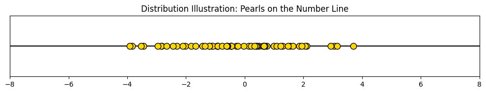
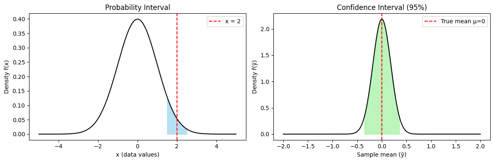

# Statistics  

## Probability Intervals and Confidence Intervals  

Suppose we look at the distribution of pearls along the number line:  

If I take a pearl at random from this distribution, what is the probability that it is exactly **2**?  

- Our first instinct is to use the probability distribution function $F(x)$.  
- If the variable $x$ is continuous, then the probability of any single point is:  

$
P(X = 2) = \int_2^2 F(x)\, dx = 0
$  

But this feels absurd! Just by looking at the distribution, we *see* that values near 2 are common. Why should the probability at 2 be zero?  

---

### Where the misconception lies  
For continuous variables, **the probability of landing on any exact value is always zero**.  
The density $F(2)$ does not give us the probability at 2 — it gives us the **relative likelihood** of being near 2.  

To make the question meaningful, we should instead ask:  

$
P(2 - \delta \leq X \leq 2 + \delta) = \int_{2 - \delta}^{2 + \delta} F(x)\, dx = k
$  

Now $k$ is a non-zero probability. As $\delta \to 0$, $k \to 0$, but the **rate** at which it shrinks is determined by the density $F(2)$.

This corrected version — asking for an **interval** instead of an exact point — resolves the paradox.  

---

### Connection to Confidence Intervals  
So far we’ve discussed **probability intervals**:  
$
P(a \leq X \leq b) = k
$  
for a random variable $X$.  

But the same mathematical structure underlies **confidence intervals**.  

- A **probability interval** is about where a *sample value* $X$ will fall.  
- A **confidence interval** is about where a *parameter estimate* (like a sample mean $\bar{X}$) will fall, relative to the true parameter.  

Formally, if $\bar{X}$ is the sample mean, then:  

$
P\!\left(\bar{X} - z_{\alpha/2}\frac{\sigma}{\sqrt{n}} \leq \mu \leq \bar{X} + z_{\alpha/2}\frac{\sigma}{\sqrt{n}}\right) = 1 - \alpha
$  

This looks structurally identical:  
$
P(a \leq Y \leq b) = k
$  
but here the random variable $Y$ is the **statistic** $\bar{X}$, not the raw data $X$.

---

### Key Insight  
Mathematically, there is no sharp boundary: both are probability statements about random variables.  
The difference is interpretational:  

- **Probability Interval:** Where will a *data point* fall?  
- **Confidence Interval:** Where does the *parameter* likely lie, given the randomness of our estimator?  

In other words:  
> A confidence interval is just a probability interval, but over the distribution of a **statistic** rather than the raw data.

---

# Bootstrapping: Resampling for Inference  

In the previous section, we saw that both **probability intervals** and **confidence intervals** are fundamentally probability statements about random variables.  
But how do we actually *construct* these intervals in practice, especially when we don’t know the exact distribution of our statistic?  

This is where **bootstrapping** enters.  

---

## Core Idea  

Bootstrapping is a **resampling technique**.  
- We start with the data we already have — our sample.  
- Instead of making strong assumptions about the underlying population, we **resample from the sample itself**, with replacement.  
- Each resampled dataset gives us a new value of our statistic (e.g., mean, variance, regression coefficient).  
- By repeating this many times, we build an **empirical distribution** of the statistic.  

This bootstrap distribution plays the same role as the theoretical sampling distribution — but we didn’t need to know or assume the population distribution to get it.  

---

## Mathematical Perspective  

Let our observed sample be:  
$
X = \{x_1, x_2, \dots, x_n\}
$  

We define a statistic:  
$
T = g(X)
$  

Since $X$ is random, so is $T$. To approximate the distribution of $T$:  

1. Generate bootstrap samples $X^{*}_1, X^{*}_2, \dots, X^{*}_B$, each of size $n$, by sampling **with replacement** from $X$.  
2. Compute the statistic for each sample:  
$
T^{*}_b = g(X^{*}_b), \quad b = 1, 2, \dots, B
$  
3. The collection $\{T^{*}_1, T^{*}_2, \dots, T^{*}_B\}$ forms the **bootstrap distribution**.  

From this bootstrap distribution we can:  
- Estimate bias  
- Compute standard errors  
- Construct confidence intervals  

---

## Confidence Intervals via Bootstrap  

The bootstrap confidence interval is built directly from the resampled distribution.  

Two common methods:  
1. **Percentile Method:**  
   Take the $\alpha/2$ and $1-\alpha/2$ quantiles of the bootstrap distribution.  
   Example: for a 95% CI, use the 2.5th and 97.5th percentiles of $\{T^{*}\}$.  

2. **Standard Error Method:**  
   Estimate the standard error of the statistic from the bootstrap distribution, then build a symmetric interval around the original estimate:  
   $
   CI = \hat{T} \pm z_{\alpha/2} \cdot \text{SE}_{\text{bootstrap}}
   $  

---

## Why It Works  

At its core, the bootstrap relies on the idea that:  
> The observed sample is already a good approximation of the population.  
> By resampling from it, we mimic the process of drawing new samples from the population.  

Thus, the bootstrap replaces **theoretical distributions** with **empirical resampling**.  

---

## Illustrations (to be added)  

1. **Figure A:** Original dataset with resampled datasets highlighted.  
2. **Figure B:** Distribution of the statistic across bootstrap replicates.  
3. **Figure C:** Bootstrap confidence interval compared to classical confidence interval.  

---

### Key Insight  

Bootstrapping provides a **non-parametric** way to do inference:  
- No assumption of normality  
- Works for complex statistics (e.g., medians, regression coefficients)  
- As long as the sample is representative and large enough, the bootstrap is powerful and robust.  
